---
## Front matter
title: "Отчёт по лабораторной работе №4"
subtitle: "дисциплина: Архитектура компьютера"
author: "Мазурский Александр Дмитриевич"

## Generic otions
lang: ru-RU
toc-title: "Содержание"

## Bibliography
bibliography: bib/cite.bib
csl: pandoc/csl/gost-r-7-0-5-2008-numeric.csl

## Pdf output format
toc: true # Table of contents
toc-depth: 2
lof: true # List of figures
lot: true # List of tables
fontsize: 12pt
linestretch: 1.5
papersize: a4
documentclass: scrreprt
## I18n polyglossia
polyglossia-lang:
  name: russian
  options:
	- spelling=modern
	- babelshorthands=true
polyglossia-otherlangs:
  name: english
## I18n babel
babel-lang: russian
babel-otherlangs: english
## Fonts
mainfont: IBM Plex Serif
romanfont: IBM Plex Serif
sansfont: IBM Plex Sans
monofont: IBM Plex Mono
mathfont: STIX Two Math
mainfontoptions: Ligatures=Common,Ligatures=TeX,Scale=0.94
romanfontoptions: Ligatures=Common,Ligatures=TeX,Scale=0.94
sansfontoptions: Ligatures=Common,Ligatures=TeX,Scale=MatchLowercase,Scale=0.94
monofontoptions: Scale=MatchLowercase,Scale=0.94,FakeStretch=0.9
mathfontoptions:
## Biblatex
biblatex: true
biblio-style: "gost-numeric"
biblatexoptions:
  - parentracker=true
  - backend=biber
  - hyperref=auto
  - language=auto
  - autolang=other*
  - citestyle=gost-numeric
## Pandoc-crossref LaTeX customization
figureTitle: "Рис."
tableTitle: "Таблица"
listingTitle: "Листинг"
lofTitle: "Список иллюстраций"
lotTitle: "Список таблиц"
lolTitle: "Листинги"
## Misc options
indent: true
header-includes:
  - \usepackage{indentfirst}
  - \usepackage{float} # keep figures where there are in the text
  - \floatplacement{figure}{H} # keep figures where there are in the text
---

# Цель работы

Цель данной лабораторной работы - освоить процедуры компиляции и сборки программ, написанных на ассемблере NASM.

# Задание

1. Создание программы Hello world!
2. Работа с транслятором NASM
3. Работа с расширенным синтаксисом командной строки NASM
4. Работа с компоновщиком LD
5. Запуск исполняемого файла
6. Выполнение заданий для самостоятельной работы.

# Теоретическое введение

Основными функциональными элементами любой ЭВМ являются центральный процессор, память и периферийные
устройства.
Взаимодействие этих устройств осуществляется через общую шину, к которой они подключены. Физически шина представляет собой большое количество проводников, соединяющих устройства друг с другом. В современных компьютерах проводники выполнены в виде электропроводящих дорожек на материнской плате.
Основной задачей процессора является обработка информации, а также организация координации всех узлов компьютера. В состав центрального процессора входят следующие устройства:
- арифметико-логическое устройство (АЛУ) — выполняет логические и арифметические действия, необходимые для обработки информации, хранящейся в памяти;
- устройство управления (УУ) — обеспечивает управление и контроль всех устройств компьютера;
- регистры — сверхбыстрая оперативная память небольшого объёма, входящая в состав процессора, для временного хранения промежуточных результатов выполнения инструкций; регистры процессора делятся на два типа: регистры общего назначения и специальные регистры.
Для того, чтобы писать программы на ассемблере, необходимо знать, какие регистры процессора существуют и как их можно использовать. Большинство команд в программах написанных на ассемблере используют регистры в каче-
стве операндов. Практически все команды представляют собой преобразование данных хранящихся в регистрах процессора, это например пересылка данных между регистрами или между регистрами и памятью, преобразование (арифметические или логические операции) данных хранящихся в регистрах.
Доступ к регистрам осуществляется не по адресам, как к основной памяти, а по именам. Каждый регистр процессора архитектуры x86 имеет свое название, состоящее из 2 или 3 букв латинского алфавита.
В качестве примера приведем названия основных регистров общего назначения (именно эти регистры чаще всего используются при написании программ):
- RAX, RCX, RDX, RBX, RSI, RDI — 64-битные
- EAX, ECX, EDX, EBX, ESI, EDI — 32-битные
- AX, CX, DX, BX, SI, DI — 16-битные
- AH, AL, CH, CL, DH, DL, BH, BL — 8-битные 

Другим важным узлом ЭВМ является оперативное запоминающее устройство (ОЗУ). ОЗУ — это быстродействующее энергозависимое запоминающее устройство, которое напрямую взаимодействует с узлами процессора, предназначенное для хранения программ и данных, с которыми процессор непосредственно работает в текущий момент. ОЗУ состоит из одинаковых пронумерованных ячеек памяти. Номер ячейки памяти — это адрес хранящихся в ней данных.
Периферийные устройства в составе ЭВМ:
- устройства внешней памяти, которые предназначены для долговременного хранения больших объёмов данных.
- устройства ввода-вывода, которые обеспечивают взаимодействие ЦП с внешней средой. 

В основе вычислительного процесса ЭВМ лежит принцип программного управления. Это означает, что компьютер решает поставленную задачу как последовательность действий, записанных в виде программы.

Коды команд представляют собой многоразрядные двоичные комбинации из 0 и 1. В коде машинной команды можно выделить две части: операционную и адресную. В операционной части хранится код команды, которую необходимо выполнить. В адресной части хранятся данные или адреса данных, которые участвуют в выполнении данной операции.
При выполнении каждой команды процессор выполняет определённую последовательность стандартных действий, которая называется командным циклом процессора. Он заключается в следующем:
1. формирование адреса в памяти очередной команды;
2. считывание кода команды из памяти и её дешифрация;
3. выполнение команды;
4. переход к следующей команде.

Язык ассемблера (assembly language, сокращённо asm) — машинно-ориентированный язык низкого уровня. 
NASM — это открытый проект ассемблера, версии которого доступны под различные операционные системы и который позволяет получать объектные файлы для этих систем. В NASM используется Intel-синтаксис и поддерживаются инструкции x86-64.

# Выполнение лабораторной работы

## Программа Hello world!

В домашней директории создаю каталог, в котором буду хранить файлы для текущей лабораторной работы. (рис. -@fig:001)

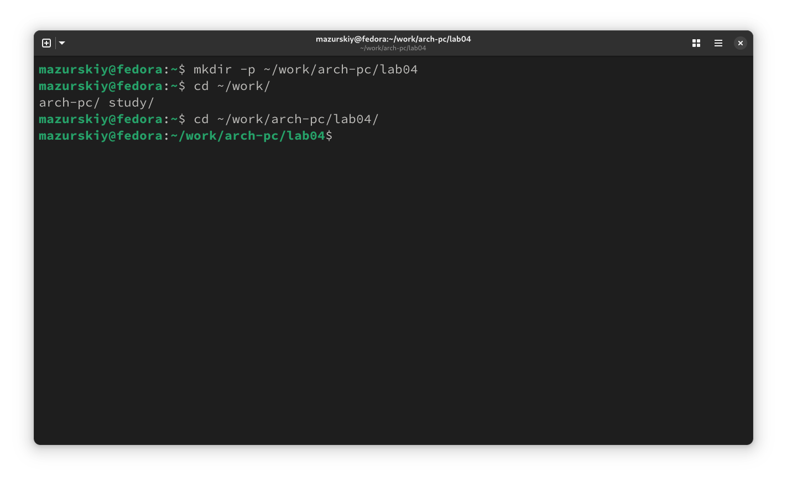{#fig:001 width=70%}

Создаю в нем файл hello.asm, в котором буду писать программу на языке ассемблера. (рис. -@fig:002)

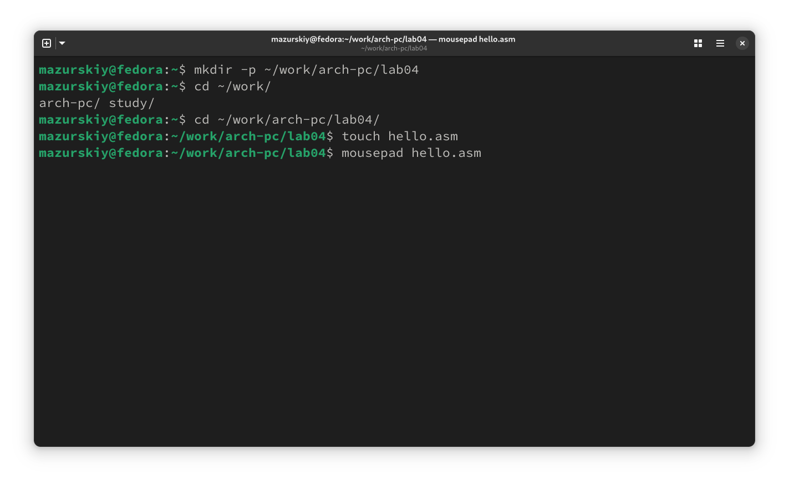{#fig:002 width=70%}

С помощью редактора пишу программу в созданном файле. (рис. -@fig:003)

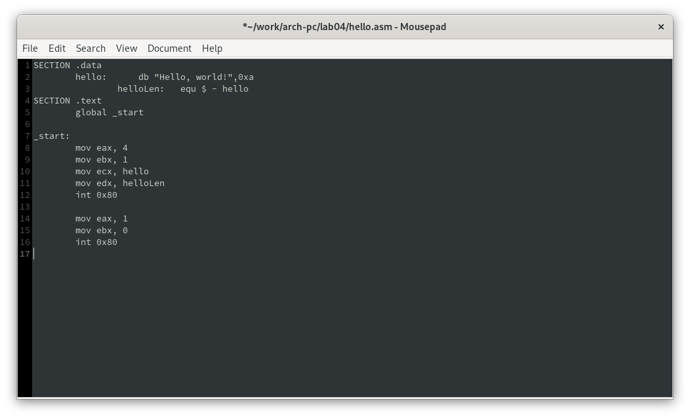{#fig:003 width=70%}

## Транслятор NASM

Компилирую с помощью NASM свою программу. (рис. -@fig:004)

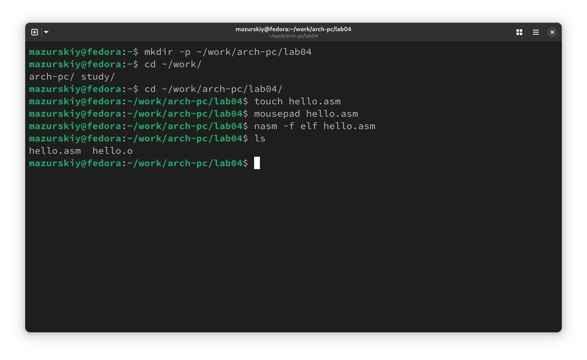{#fig:004 width=70%}

## Расширенный синтаксис командной строки NASM

Выполняю команду, указанную на (рис. -@fig:005), она скомпилировала исходный файл hello.asm в obj.o, расшиерние .o говорит о том, что файл - объектный, помимо него флаги -g -l подготвоят файл отладки и листинга соответственно.

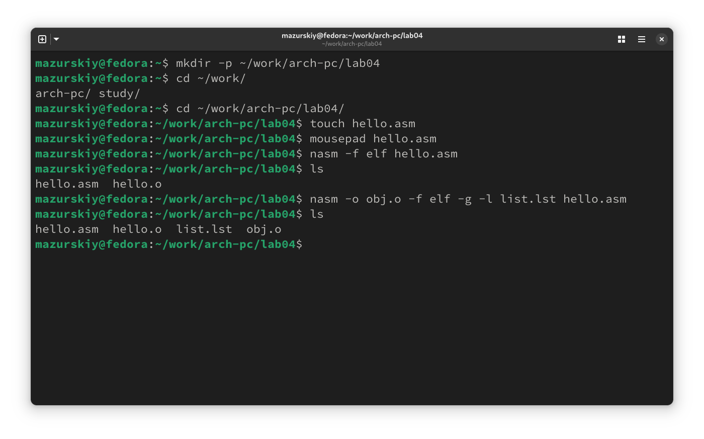{#fig:005 width=70%}

## Компоновщик LD

Затем мне необходимо передать объектный файл компоновщику, делаю это с помощью команды ld. (рис. -@fig:006)

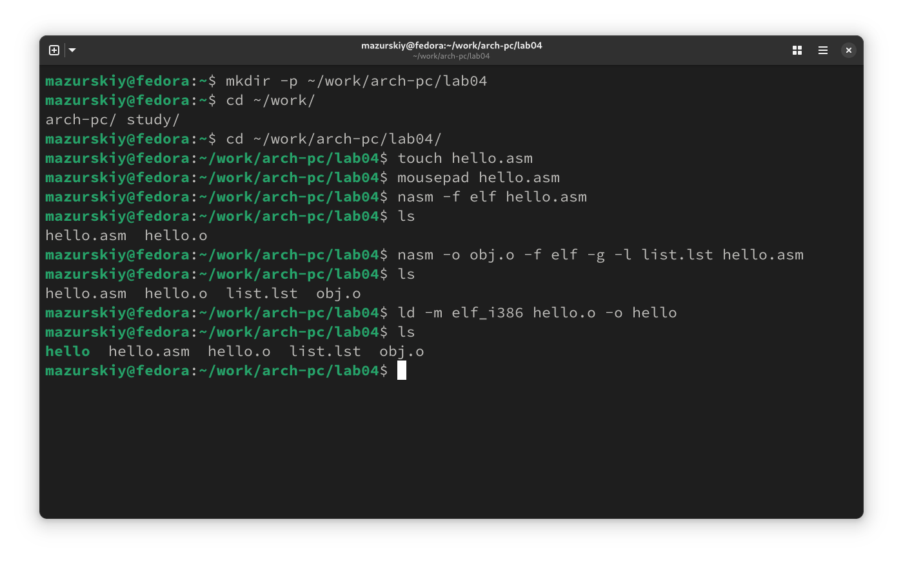{#fig:006 width=70%}

Выполняю следующую команду ..., результатом исполнения команды будет созданный файл main, скомпонованный из объектного файла obj.o. (рис. -@fig:007)

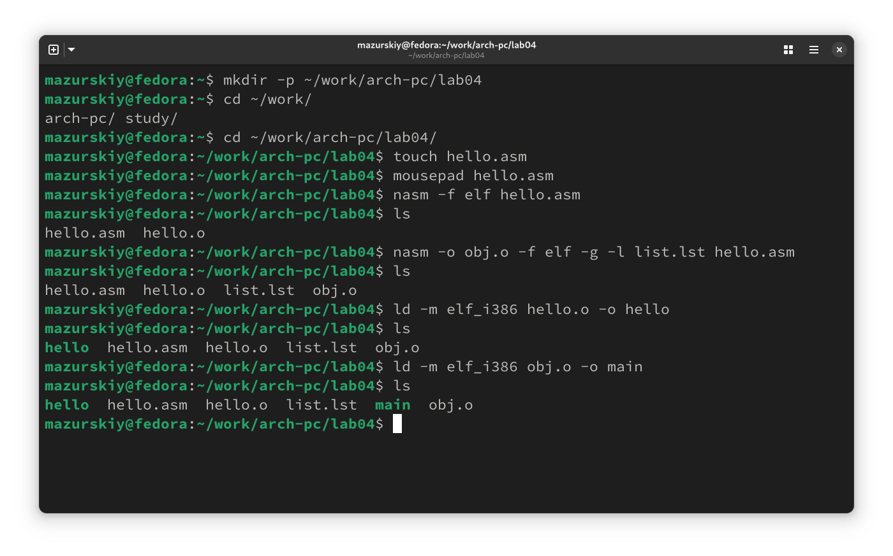{#fig:007 width=70%}

## Запуск исполняемого файла 

Запускаю исполняемый файл из текущего каталога. (рис. -@fig:008)

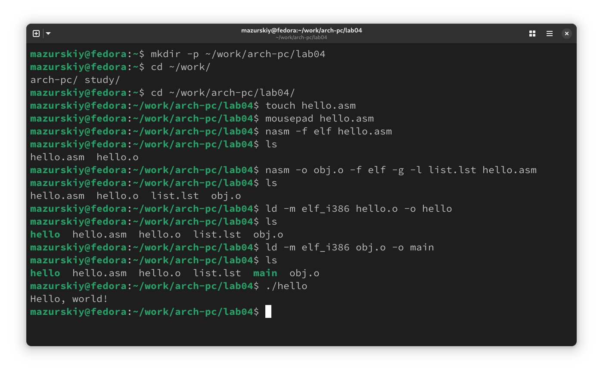{#fig:008 width=70%}

## Задания для самостоятельной работы

Создаю копию файла для последующей работы с ней. (рис. -@fig:009)

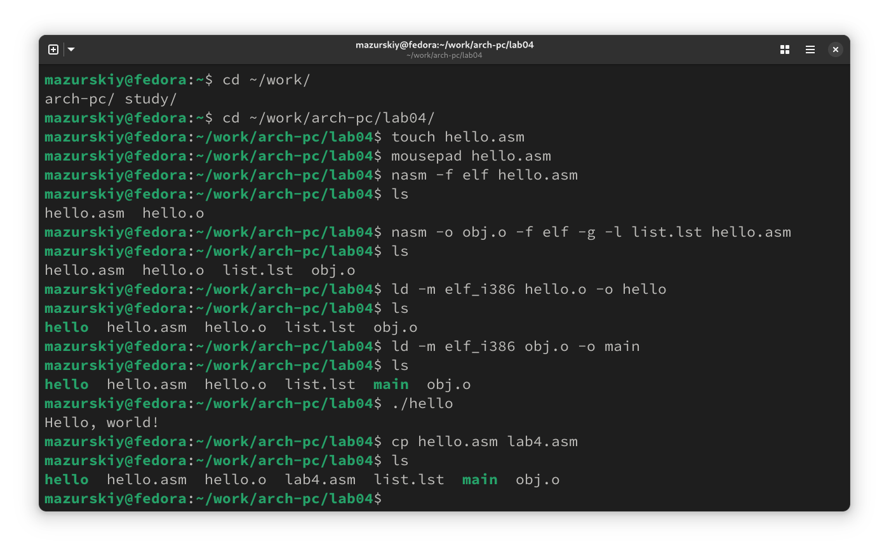{#fig:009 width=70%}

Редактирую копию файла, заменив текст на свое имя и фамилию. (рис. -@fig:010)

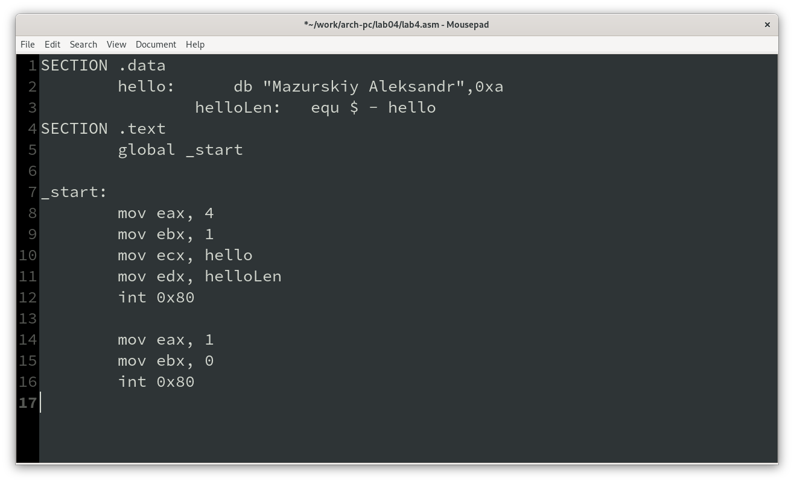{#fig:010 width=70%}

Транслирую копию файла в объектный файл, компоную и запускаю. (рис. -@fig:011)

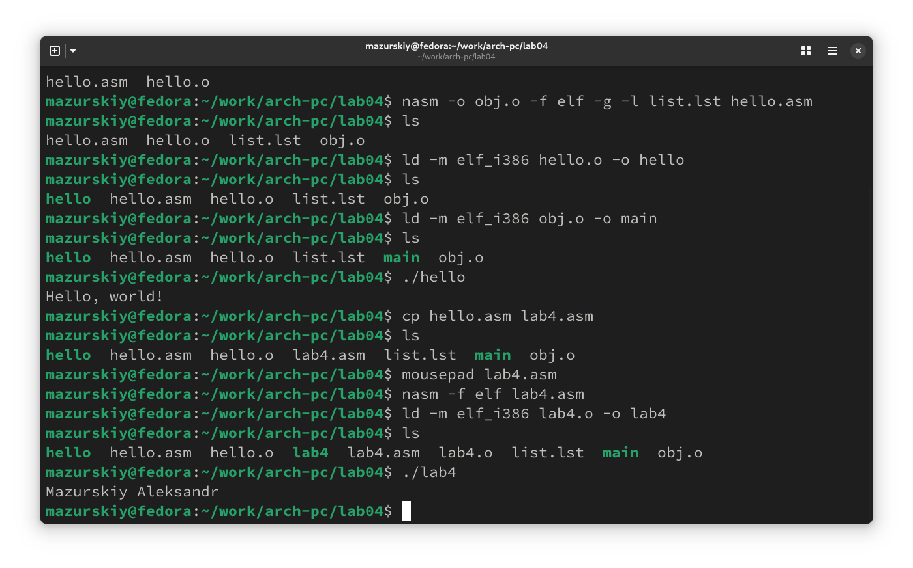{#fig:011 width=70%}

Убедившись в корректности работы программы, копирую рабочие файлы в свой локальный репозиторий. (рис. -@fig:012)

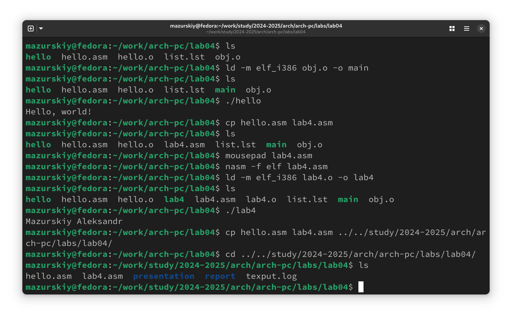{#fig:012 width=70%}

Загрузка изменений на свой удаленный репозиторий на GitHub. (рис. -@fig:013)

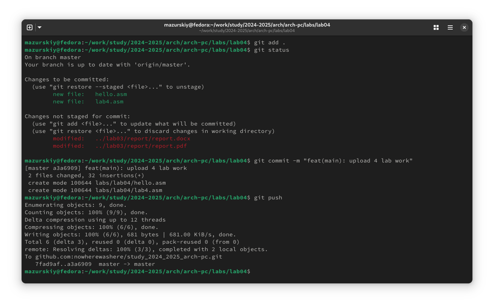{#fig:013 width=70%}

# Выводы

При выполнении данной лабораторной работы я освоила процедуры компиляции и сборки программ, написанных на ассемблере NASM.

# Список литературы

1. [Пример выполнения лабораторной работы](https://github.com/evdvorkina/study_2022-2023_arh-pc/blob/master/labs/lab05/report/%D0%9B05_%D0%94%D0%B2%D0%BE%D1%80%D0%BA%D0%B8%D0%BD%D0%B0_%D0%BE%D1%82%D1%87%D0%B5%D1%82.md?plain=1)
2. [Курс на ТУИС](https://esystem.rudn.ru/course/view.php?id=112)
3. [Лабораторная работа №4](https://esystem.rudn.ru/pluginfile.php/2089084/mod_resource/content/0/%D0%9B%D0%B0%D0%B1%D0%BE%D1%80%D0%B0%D1%82%D0%BE%D1%80%D0%BD%D0%B0%D1%8F%20%D1%80%D0%B0%D0%B1%D0%BE%D1%82%D0%B0%20%E2%84%964.%20%D0%A1%D0%BE%D0%B7%D0%B4%D0%B0%D0%BD%D0%B8%D0%B5%20%D0%B8%20%D0%BF%D1%80%D0%BE%D1%86%D0%B5%D1%81%D1%81%20%D0%BE%D0%B1%D1%80%D0%B0%D0%B1%D0%BE%D1%82%D0%BA%D0%B8%20%D0%BF%D1%80%D0%BE%D0%B3%D1%80%D0%B0%D0%BC%D0%BC%20%D0%BD%D0%B0%20%D1%8F%D0%B7%D1%8B%D0%BA%D0%B5%20%D0%B0%D1%81%D1%81%D0%B5%D0%BC%D0%B1%D0%BB%D0%B5%D1%80%D0%B0%20NASM.pdf)
4. [Программирование на языке ассемблера NASM Столяров А. В.](https://esystem.rudn.ru/pluginfile.php/2088953/mod_resource/content/2/%D0%A1%D1%82%D0%BE%D0%BB%D1%8F%D1%80%D0%BE%D0%B2%20%D0%90.%20%D0%92.%20-%20%D0%9F%D1%80%D0%BE%D0%B3%D1%80%D0%B0%D0%BC%D0%BC%D0%B8%D1%80%D0%BE%D0%B2%D0%B0%D0%BD%D0%B8%D0%B5%20%D0%BD%D0%B0%20%D1%8F%D0%B7%D1%8B%D0%BA%D0%B5%20%D0%B0%D1%81%D1%81%D0%B5%D0%BC%D0%B1%D0%BB%D0%B5%D1%80%D0%B0%20NASM%20%D0%B4%D0%BB%D1%8F%20%D0%9E%D0%A1%20Unix.pdf)

