---
## Front matter
title: "Отчет по лабораторной работе №6"
subtitle: "Дисциплина: архитектура компьютера"
author: "Мазурский Александр Дмитриевич"

## Generic otions
lang: ru-RU
toc-title: "Содержание"

## Bibliography
bibliography: bib/cite.bib
csl: pandoc/csl/gost-r-7-0-5-2008-numeric.csl

## Pdf output format
toc: true # Table of contents
toc-depth: 2
lof: true # List of figures
lot: true # List of tables
fontsize: 12pt
linestretch: 1.5
papersize: a4
documentclass: scrreprt
## I18n polyglossia
polyglossia-lang:
  name: russian
  options:
	- spelling=modern
	- babelshorthands=true
polyglossia-otherlangs:
  name: english
## I18n babel
babel-lang: russian
babel-otherlangs: english
## Fonts
mainfont: IBM Plex Serif
romanfont: IBM Plex Serif
sansfont: IBM Plex Sans
monofont: IBM Plex Mono
mathfont: STIX Two Math
mainfontoptions: Ligatures=Common,Ligatures=TeX,Scale=0.94
romanfontoptions: Ligatures=Common,Ligatures=TeX,Scale=0.94
sansfontoptions: Ligatures=Common,Ligatures=TeX,Scale=MatchLowercase,Scale=0.94
monofontoptions: Scale=MatchLowercase,Scale=0.94,FakeStretch=0.9
mathfontoptions:
## Biblatex
biblatex: true
biblio-style: "gost-numeric"
biblatexoptions:
  - parentracker=true
  - backend=biber
  - hyperref=auto
  - language=auto
  - autolang=other*
  - citestyle=gost-numeric
## Pandoc-crossref LaTeX customization
figureTitle: "Рис."
tableTitle: "Таблица"
listingTitle: "Листинг"
lofTitle: "Список иллюстраций"
lotTitle: "Список таблиц"
lolTitle: "Листинги"
## Misc options
indent: true
header-includes:
  - \usepackage{indentfirst}
  - \usepackage{float} # keep figures where there are in the text
  - \floatplacement{figure}{H} # keep figures where there are in the text
---

# Цель работы

Цель данной лабораторной работы - освоение арифметческих инструкций
языка ассемблера NASM.

# Задание

1. Символьные и численные данные в NASM
2. Выполнение арифметических операций в NASM
3. Выполнение заданий для самостоятельной работы

# Теоретическое введение

Большинство инструкций на языке ассемблера требуют обработки операндов.
Адрес операнда предоставляет место, где хранятся данные, подлежащие обработке. Это могут быть данные хранящиеся в регистре или в ячейке памяти. -
Регистровая адресация – операнды хранятся в регистрах и в команде используются имена этих регистров, например: mov ax,bx. - Непосредственная адресация
– значение операнда задается непосредственно в команде, Например: mov ax,2.
- Адресация памяти – операнд задает адрес в памяти. В команде указывается
символическое обозначение ячейки памяти, над содержимым которой требуется
выполнить операцию.
Ввод информации с клавиатуры и вывод её на экран осуществляется в символьном виде. Кодирование этой информации производится согласно кодовой таблице символов ASCII. ASCII – сокращение от American Standard Code for Information
Interchange (Американский стандартный код для обмена информацией). Согласно стандарту ASCII каждый символ кодируется одним байтом. Среди инструкций
NASM нет такой, которая выводит числа (не в символьном виде). Поэтому, например, чтобы вывести число, надо предварительно преобразовать его цифры в
ASCII-коды этих цифр и выводить на экран эти коды, а не само число. Если же
выводить число на экран непосредственно, то экран воспримет его не как число,
а как последовательность ASCII-символов – каждый байт числа будет воспринят
как один ASCII-символ – и выведет на экран эти символы. Аналогичная ситуация происходит и при вводе данных с клавиатуры. Введенные данные будут
представлять собой символы, что сделает невозможным получение корректного
результата при выполнении над ними арифметических операций. Для решения
этой проблемы необходимо проводить преобразование ASCII символов в числа
и обратно.

# Выполнение лабораторной работы

## Символьные и численные данные в NASM

Создаю каталог для программ лабораторной работы №6 и перехожу в него, создаю там файл (рис. -@fig:001).

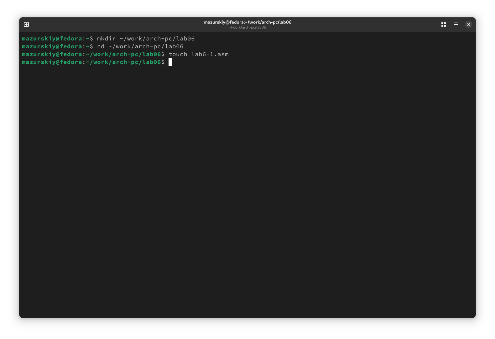{#fig:001 width=70%}

В созданном файле ввожу программу из листинга (рис. -@fig:002).

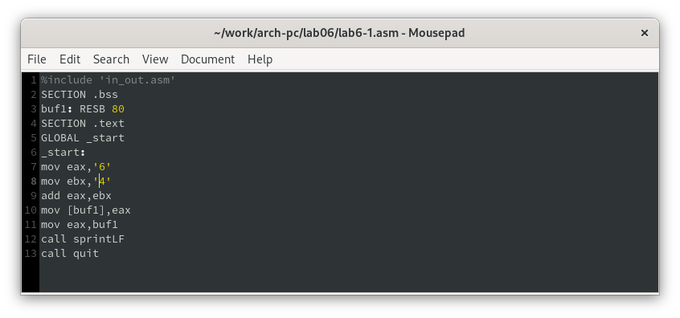{#fig:002 width=70%}

Создаю исполняемый файл и запускаю его, вывод программы отличается от предполагаемого изначально, ибо коды символов в сумме дают символ j по таблице ASCII. {#fig:003 width=70%} 

{#fig:003 width=70%}

Изменяю текст изначальной программы, убрав кавычки (рис. -@fig:004).

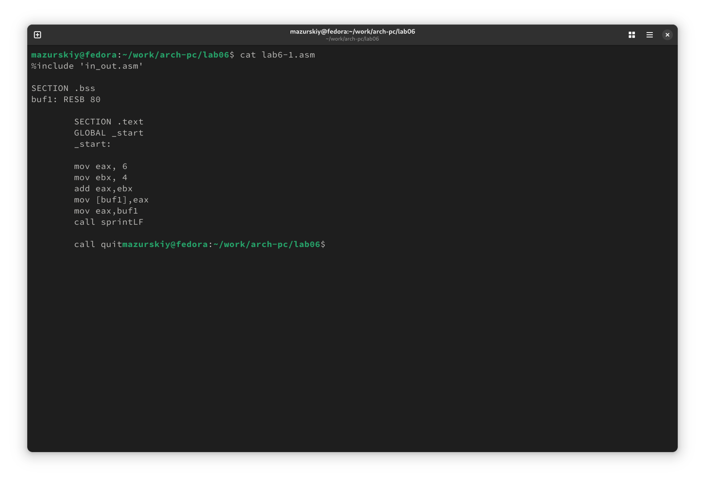{#fig:004 width=70%}

На этот раз программа выдала пустую строчку, это связано с тем, что символ 10 означает переход на новую строку (рис. -@fig:005).

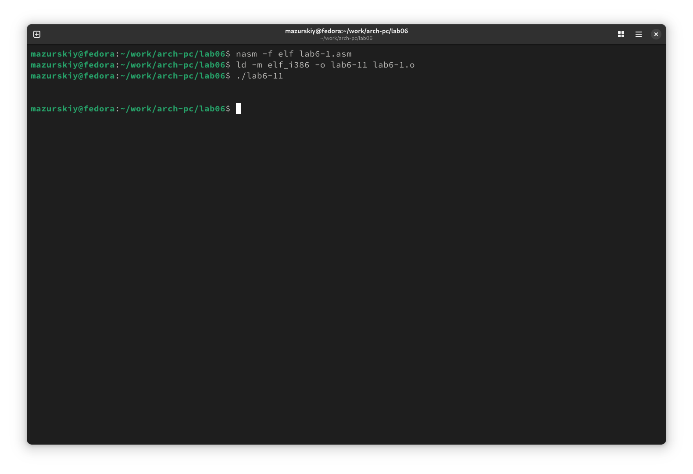{#fig:005 width=70%}

Создаю новый файл для будущей программы и записываю в нее код из листинга (рис. -@fig:006).

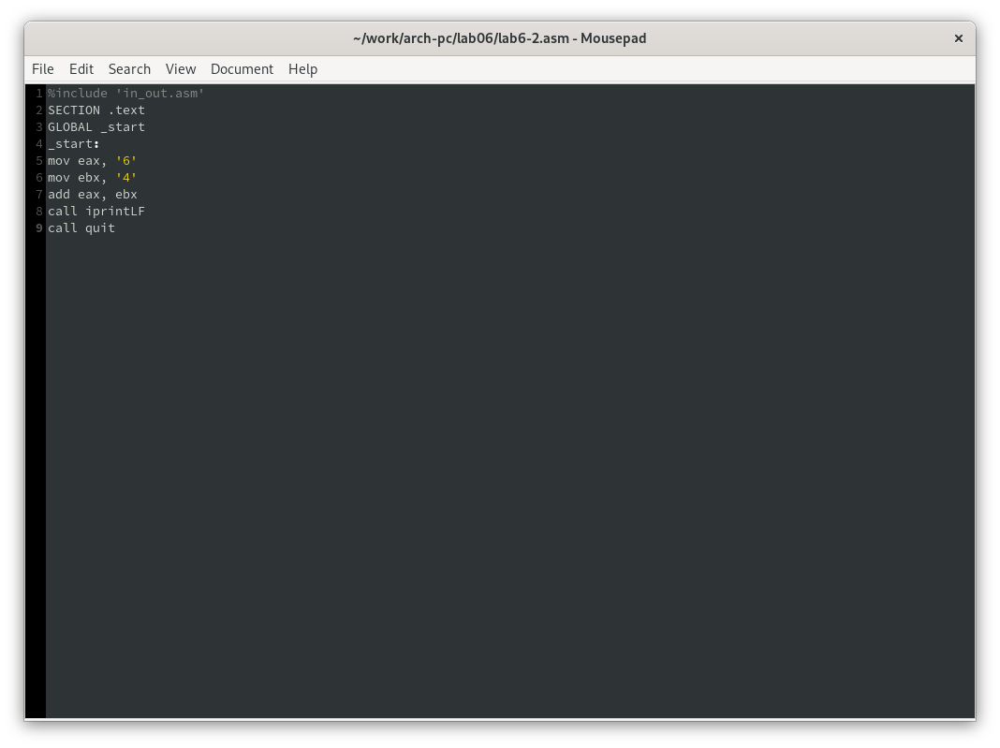{#fig:006 width=70%}

Создаю исполняемый файл и запускаю его, теперь отображается результат 106, программа, как и в первый раз, сложила коды символов, но вывела само число, а не его символ, благодяря замене функции вывода на iprintLF (рис. -@fig:007).

{#fig:007 width=70%}

Убрав кавычки в программе, я снова ее запускаю и получаю предполагаемый изначально результат. (рис. -@fig:008).

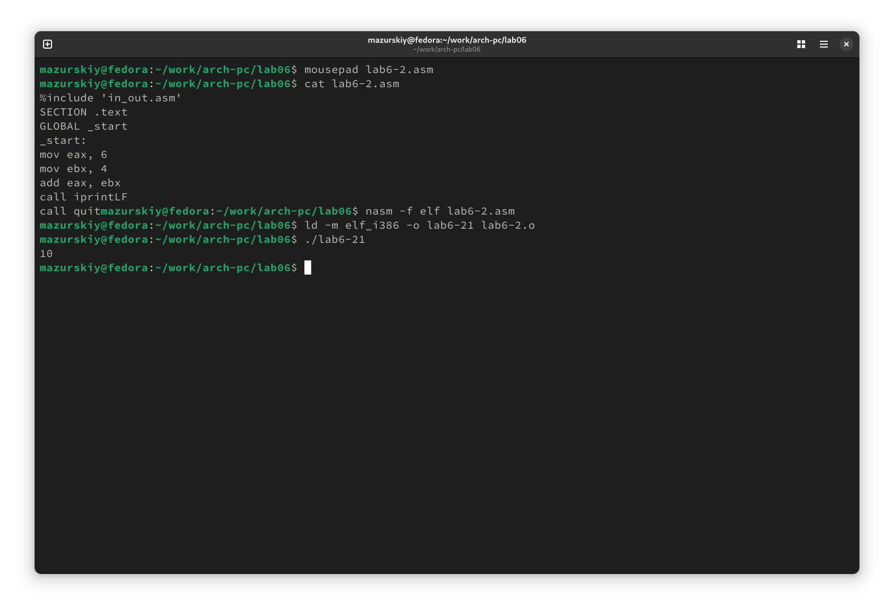{#fig:008 width=70%}

Заменив функцию вывода на iprint, я получаю тот же результат, но без переноса строки (рис. -@fig:009).

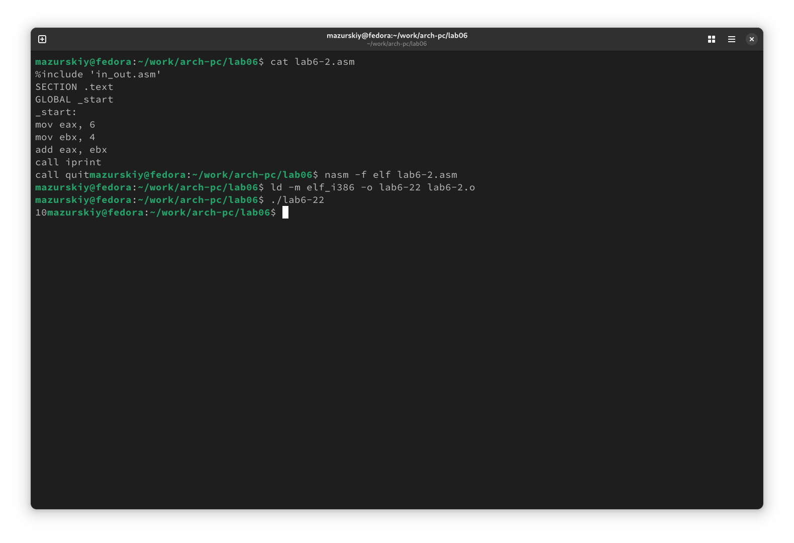{#fig:009 width=70%}

## Выполнение арифметических операций в NASM

Создаю новый файл и копирую в него содержимое листинга (рис. -@fig:010).

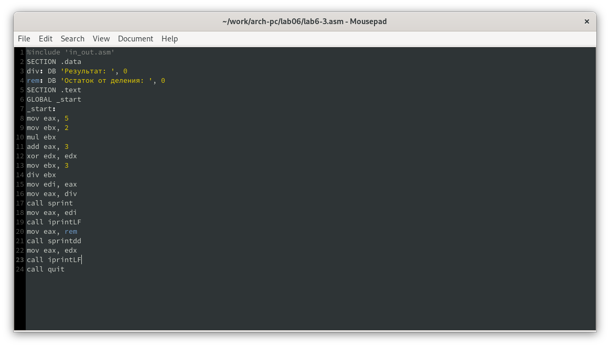{#fig:010 width=70%}

Программа выполняет арифметические вычисления, на вывод идет результирующее выражения и его остаток от деления (рис. -@fig:011).

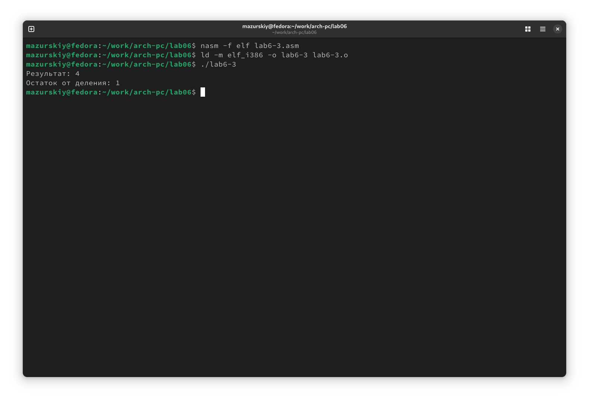{#fig:011 width=70%}

Заменив переменные в программе для выражения f(x) = (4*6+2)/5 (рис. -@fig:012).

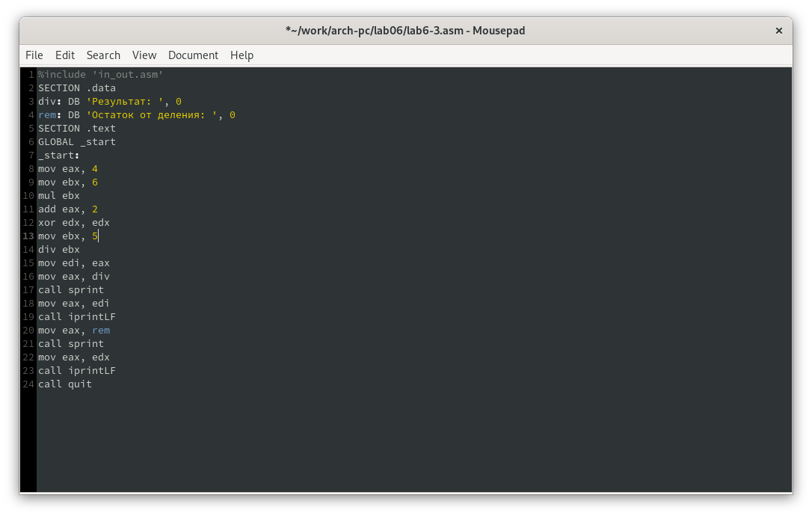{#fig:012 width=70%}

Запуск программы дает корректный результат (рис. -@fig:013).

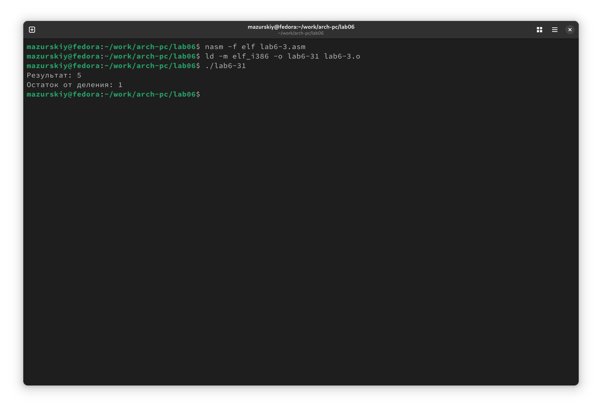{#fig:013 width=70%}

Создаю новый файл и помещаю текст из листинга (рис. -@fig:014).

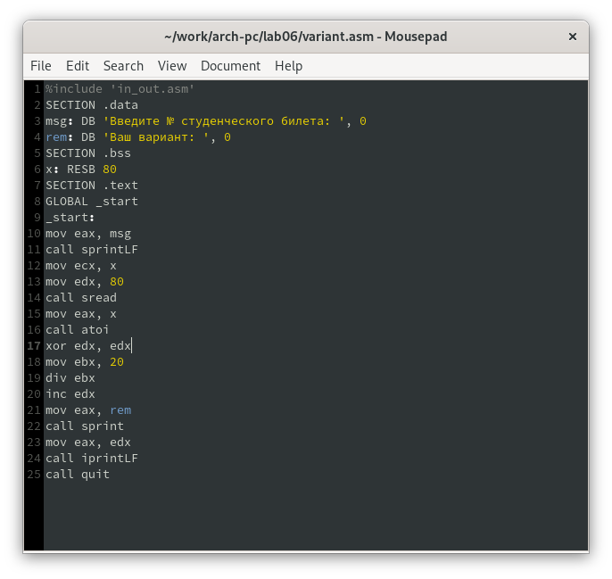{#fig:014 width=70%}

Запустив программу и указав свой номер студенческого билета, я получил свой вариант для дальнейшей работы. (рис. -@fig:015).

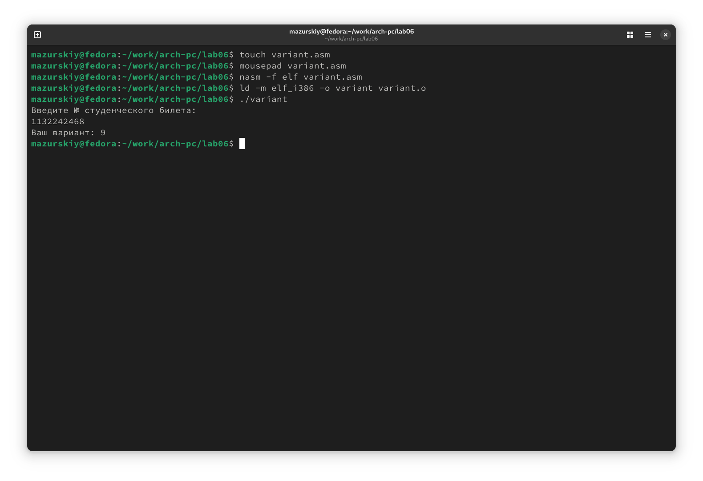{#fig:015 width=70%}

## Ответы на контрольные вопросы

1. За вывод сообщения “Ваш вариант” отвечают строки кода:

```NASM
mov eax,rem
call sprint
```
2. Инструкция mov ecx, x используется, чтобы положить адрес вводимой строки x в регистр ecx mov edx, 80 - запись в регистр edx длины вводимой строки
call sread - вызов подпрограммы из внешнего файла, обеспечивающей ввод
сообщения с клавиатуры.

3. call atoi используется для вызова подпрограммы из внешнего файла, которая преобразует ascii-код символа в целое число и записывает результат в
регистр eax.

4. За вычисления варианта отвечают строки:

```NASM
xor edx,edx ; обнуление edx для корректной работы div
mov ebx,20 ; ebx = 20
div ebx ; eax = eax/20, edx - остаток от деления
inc edx ; edx = edx + 1
```

5. При выполнении инструкции div ebx остаток от деления записывается в
регистр edx.

6. Инструкция inc edx увеличивает значение регистра edx на 1.

7. За вывод на экран результатов вычислений отвечают строки:

```NASM
mov eax,edx
call iprintLF
```

## Задание для самостоятельной работы

В соответсвии с выбранным вариантом, я реализую программу для подсчета функции f(x) = 10+(31x-5), проверка на нескольких переменных показывает корректное выполнение программы (рис. -@fig:016).

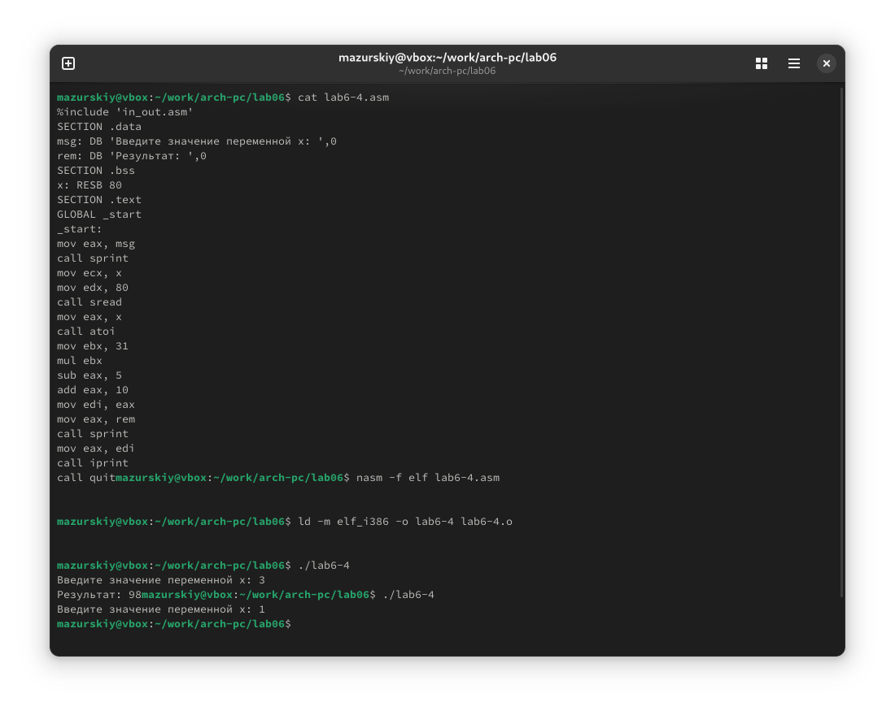{#fig:016 width=70%} 

Прилагаю код своей программы:

```NASM
%include 'in_out.asm'
SECTION .data
msg: DB 'Введите значение переменной х: ',0
rem: DB 'Результат: ',0
SECTION .bss
x: RESB 80
SECTION .text
GLOBAL _start
_start:
mov eax, msg
call sprint
mov ecx, x
mov edx, 80
call sread
mov eax, x
call atoi
mov ebx, 31
mul ebx
sub eax, 5
add eax, 10
mov edi, eax
mov eax, rem
call sprint
mov eax, edi
call iprint
```

# Выводы

При выполнении данной лабораторной работы я освоил арифметические инструкции языка ассемблера NASM.

# Список литературы

1. [Пример выполнения лабораторной работы](https://github.com/evdvorkina/study_2022-2023_arh-pc/blob/master/labs/lab07/report/%D0%9B07_%D0%94%D0%B2%D0%BE%D1%80%D0%BA%D0%B8%D0%BD%D0%B0_%D0%BE%D1%82%D1%87%D0%B5%D1%82.pdf)
2. [Курс на ТУИС](https://esystem.rudn.ru/course/view.php?id=112)
3. [Лабораторная работа №6](https://esystem.rudn.ru/pluginfile.php/2089086/mod_resource/content/0/%D0%9B%D0%B0%D0%B1%D0%BE%D1%80%D0%B0%D1%82%D0%BE%D1%80%D0%BD%D0%B0%D1%8F%20%D1%80%D0%B0%D0%B1%D0%BE%D1%82%D0%B0%20%E2%84%966.%20%D0%90%D1%80%D0%B8%D1%84%D0%BC%D0%B5%D1%82%D0%B8%D1%87%D0%B5%D1%81%D0%BA%D0%B8%D0%B5%20%D0%BE%D0%BF%D0%B5%D1%80%D0%B0%D1%86%D0%B8%D0%B8%20%D0%B2%20NASM.pdf)
4. [Программирование на языке ассемблера NASM Столяров А. В.](https://esystem.rudn.ru/pluginfile.php/2088953/mod_resource/content/2/%D0%A1%D1%82%D0%BE%D0%BB%D1%8F%D1%80%D0%BE%D0%B2%20%D0%90.%20%D0%92.%20-%20%D0%9F%D1%80%D0%BE%D0%B3%D1%80%D0%B0%D0%BC%D0%BC%D0%B8%D1%80%D0%BE%D0%B2%D0%B0%D0%BD%D0%B8%D0%B5%20%D0%BD%D0%B0%20%D1%8F%D0%B7%D1%8B%D0%BA%D0%B5%20%D0%B0%D1%81%D1%81%D0%B5%D0%BC%D0%B1%D0%BB%D0%B5%D1%80%D0%B0%20NASM%20%D0%B4%D0%BB%D1%8F%20%D0%9E%D0%A1%20Unix.pdf)
